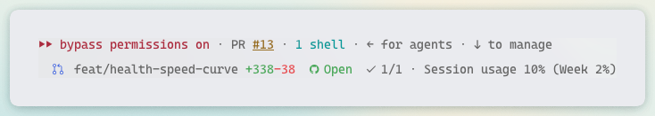
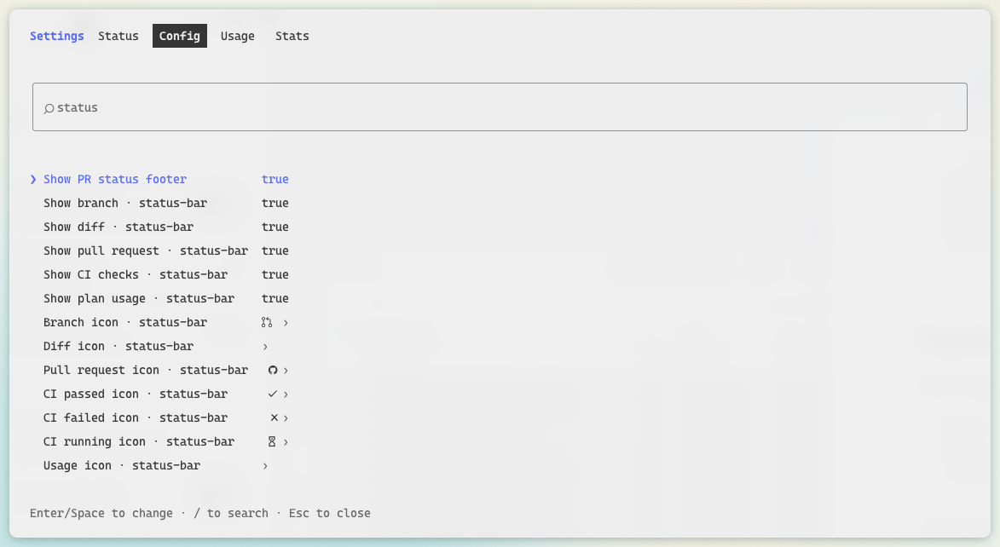

# status-bar

A [Claude Code](https://claude.com/claude-code) mod that adds a colored status line under the prompt, with the
engine's own hint line (`? for shortcuts`, `esc to interrupt`…):



| Segment | What it shows | Color |
| --- | --- | --- |
| Branch | Current branch, or the short SHA on a detached HEAD | Branch icon colored |
| Diff | Lines added and removed against the merge base with the default branch, uncommitted work included | `+N` green, `-N` red |
| Pull request | State of the branch's PR: `Merged`, `Closed`, `Draft` or `Open` | Purple, red, gray, green |
| CI | Passed checks out of the total, with an icon for all passed, any failed, or still running | — |
| Usage | Your plan's 5-hour session usage and weekly usage | Orange from 65%, red from 75% (whichever window is fuller) |

Segments with nothing to show are left out: outside a git repository there is no git part, without a PR there is no
PR or CI part, and off a Claude subscription there is no usage part.

## Requirements

- Claude Code with function hooks (mods). They are early access; this mod is tested on **2.1.289**.
- A [Nerd Font](https://www.nerdfonts.com/) in your terminal, for the icons.
- `git`, and the [GitHub CLI](https://cli.github.com/) (`gh`) logged in for the PR and CI segments.

## Install

```sh
claude plugin marketplace add victor-falcon/claude-status-bar
claude plugin install status-bar@claude-status-bar
```

Start a new session, or run `/reload-plugins` in a running one.

If you had a `statusLine` command in your settings, you can remove it: this mod replaces it.

## How it refreshes

- Branch and diff: every 5 seconds and after every turn.
- Pull request and CI: every 60 seconds, and right after a `gh pr`, `git push`, `git checkout` or `git switch` run by
  Claude.
- Usage: whenever Claude Code measures it again.

## Configure

Every section can be switched off and every icon changed from `/config`, where each option is a row. Claude Code
stores them in `settings.json` under `pluginConfigs`, and the mod reloads as soon as one changes.



| Option | Default | What it does |
| --- | --- | --- |
| `showBranch` | `true` | Show the branch |
| `showDiff` | `true` | Show the lines added and removed (off, the mod skips `git diff`) |
| `showPullRequest` | `true` | Show the pull request state |
| `showChecks` | `true` | Show the CI checks (with the pull request off too, the mod never calls `gh`) |
| `showUsage` | `true` | Show the plan usage |
| `iconBranch` | Nerd Font branch | Drawn before the branch name |
| `iconDiff` | none | Drawn before the added and removed lines |
| `iconPullRequest` | Nerd Font GitHub | Drawn before the pull request state |
| `iconChecksPassed` | Nerd Font check | Drawn before the checks when every one passed |
| `iconChecksFailed` | Nerd Font cross | Drawn before the checks when any failed |
| `iconChecksPending` | Nerd Font hourglass | Drawn before the checks while some are still running |
| `iconUsage` | none | Drawn before the plan usage |

Icons are used as written, spaces included. Leave one empty for its default, or write `none` to draw no icon. The
dialog Claude Code opens on install shows every icon field empty, as it never fills a text field with its default:
save it as it is to keep the default icons.

## Customize

Default icons, colors and thresholds are constants at the top of [`hooks/format.ts`](hooks/format.ts) (`DEFAULT_ICONS`,
`COLOR_*`, `PULL_REQUEST_COLORS`, `USAGE_WARNING_PERCENT`, `USAGE_CRITICAL_PERCENT`). Colors are a Claude Code theme
key or a raw color (`green`, `#ff8700`).

To run your own copy, clone this repository and load it from disk instead of installing it:

```sh
claude --plugin-dir /path/to/claude-status-bar
```

or, for every session, set `CLAUDE_CODE_PLUGIN_DIRS` to that path in the `env` block of `~/.claude/settings.json`. The
folder is watched, so saving a file reloads the mod.

## Development

```sh
claude plugin validate .
claude plugin test .
```

## License

[MIT](LICENSE)
